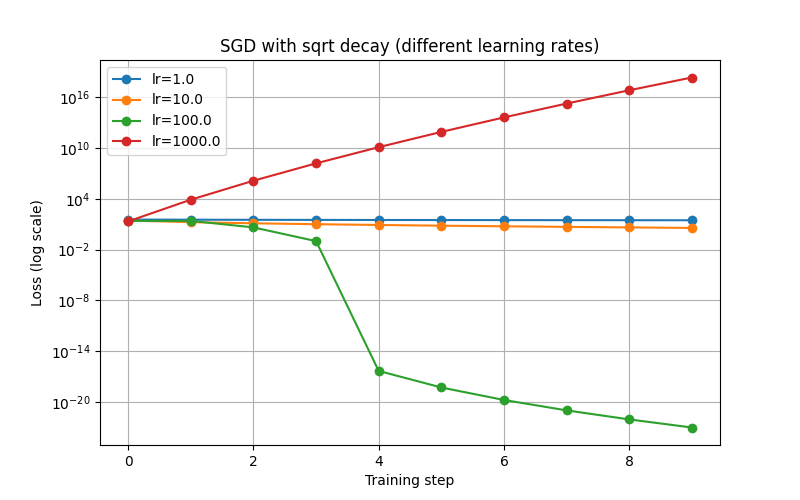

# CS336 Spring 2025 Assignment 1: Basics

## Problem (unicode1): Understanding Unicode (1 point)

(a) `chr(0) --> U+0000`，为空字符。

(b) `chr(0).__repr__()` 显示 `'\x00'`, `print` 时没有任何显式输出。

(c) 当嵌入文本时，它仍然是字符串的一部分（影响长度），但在 `print` 时是不可见的。

## Problem (unicode2): Unicode Encodings (3 points)

(a) 因为 UTF-8 编码兼容 ASCII 且在常见语言中更紧凑，无须为每个字符填充额外的字节，而 UTF-16/32 会引入大量零字节并占用更多存储空间，不利于分词器学习。

- UTF-32 中，单个英文字符需要占据 4 个字节。
- UTF-16 中，每个字符根据其对应的码位（code point）大小，可以使用 2 个字节表示或者 4 个字节表示。
- UTF-8 中，每个字符根据其对应的码位（code point）大小，可以使用 1 个或者 2 个或者 4 个字节表示，

(b) 以 `test_string="hello! こんにちは!"` 为例，日文 UTF-8 编码并非 1:1 匹配，该函数逐字节解码会出错。

```python
def decode_utf8_bytes_to_str_wrong(bytestring: bytes):
	return "".join([bytes([b]).decode("utf-8") for b in bytestring])
>>> decode_utf8_bytes_to_str_wrong("hello! こんにちは!".encode("utf-8"))
Traceback (most recent call last):
  File "<python-input-1>", line 1, in <module>
    decode_utf8_bytes_to_str_wrong("hello! こんにちは!".encode("utf-8"))
    ~~~~~~~~~~~~~~~~~~~~~~~~~~~~~~^^^^^^^^^^^^^^^^^^^^^^^^^^^^^^^^^^^^^^
  File "<python-input-0>", line 2, in decode_utf8_bytes_to_str_wrong
    return "".join([bytes([b]).decode("utf-8") for b in bytestring])
                    ~~~~~~~~~~~~~~~~~^^^^^^^^^
UnicodeDecodeError: 'utf-8' codec can't decode byte 0xe3 in position 0: unexpected end of data
```

(c) 例如 `b'\xff\x80'`、`b'\xc0\x00'` 在 UTF-8 中并非任何合法字符的编码，因此无法解码成有效的 Unicode 字符。

```python
>>> (b'\xff\x80').decode("utf-8")
Traceback (most recent call last):
  File "<python-input-2>", line 1, in <module>
    (b'\xff\x80').decode("utf-8")
    ~~~~~~~~~~~~~~~~~~~~^^^^^^^^^
UnicodeDecodeError: 'utf-8' codec can't decode byte 0xff in position 0: invalid start byte
```

在 UTF-8 中，
- 如果第一个字节 (leading byte) 的最高位是 0，那么表示占 1 个字节（兼容 ASCII）。
- 如果第一个字节的最高三位是 110，那么表示这个字符占 2 个字节，第二个字节的最高 2 位是 10。
- 如果第一个字节的最高四位是 1110，那么表示这个字符占 3 个字节，第 2 和第 3 个字节的最高 2 位都是 10。
- 如果第一个字节的最高五位是 11110，那么表示这个字符占 4 个字节，第 2 和第 3 个和第 4 个字节的最高 2 位都是 10。
- UTF-8 还可以扩展到 6 字节，这样就能表示更多的码位，

```
1100 0000, 1000 0000
c 0, 8 0 
```

然而 `\xc0\x81` 虽然字节格式合法，但它是对 `U+0001` 的超长编码，根据 UTF-8 规范同样被禁止。

## Problem (train_bpe): BPE Tokenizer Training (15 points)

见 cs336_basics/bpe，值得注意的几个点：
1. 先 pretokenize 成单词，只统计词内的neighbor。
2. 可能出现 aaaa，合并 a a 的情况，所以 merge 后的统计需要逐个计算。
3. pretokenize 的时候，注意 special token 的处理，不能直接把 special_group 放在总模式的最前面，当文本中出现带前导空格的特殊符号（例如 " <|endoftext|>"）时，当前扫描位置在空格处，special_group 不能从空格开始匹配，随后分支  ?[^\s\p{L}\p{N}]+ 会把空格+< 等一起吃掉，导致整段 <|endoftext|> 没被识别为一个特殊 token。

这里的做法是，先按“特殊 token”切，再对普通片段用原 PAT 切。

并且在此逻辑下原始的 split chunk 部分也有 bug，应该直接对每个候选边界点，向后滚动读取 mini-chunk，携带 max_token_len-1 的尾部重叠，在拼接窗口中找任意特殊 token 的最早出现位置，确保不会漏掉跨块匹配。

至此，即可 pass 全部 test_train_bpe.py 单元测试。

## Problem (train_bpe_tinystories): BPE Training on TinyStories (2 points)

```
[BPE] Timing (seconds)
  tokenizer_init: 0.0001
  pretokenize   : 176.1652
  initial_count : 0.0964
  merge_loop    : 241.8450
  total         : 418.1071
```

## Problem (train_bpe_expts_owt): BPE Training on OpenWebText (2 points)

to be done

## Problem (tokenizer): Implementing the tokenizer (15 points)

见 cs336_basics/bpe/tokenizer.py，值得注意的几个点：
1. 跟 tokenizer 部分相同，注意对 special token 的处理。
2. 出现重叠的 special token 如` <|endoftext|><|endoftext|>`，应当排序，从长的开始匹配。
3. BPE 合并时应当按照从前往后 merge 的顺序进行。

至此，即可 pass 全部 test_tokenizer.py 单元测试。

## Problem (tokenizer_experiments): Experiments with tokenizers (4 points)

to be done

## Problem(transformer_accounting):TransformerLMresourceaccounting (5points)

batch 设为 1；序列长度 $L= \text{context\_length}$（除 (e) 特别说明外）；

仅统计矩阵乘 FLOPs（其他如加法/激活/归一化/softmax 不计）；

注意力是标准 MHA：

线性投影：$Q, K, V, O$ 的权重都是 $(d_{\text{model}}, d_{\text{model}})$；

缩放点积：每个 head 维度 $d_k=d_v=d_{\text{model}}/h$；

FFN 采用常见的门控变体（如 SwiGLU）：

$$
\text{FFN}(x) = \text{SwiGLU}(x,W_1,W_2,W_3) = W_2 (\text{SiLU}(W_1x)\odot W_3x)
$$

$w_1$: $d_{\text{model}}\!\to\! d_{\text{ff}}$、$w_3$: $d_{\text{model}}\!\to\! d_{\text{ff}}$、$w_2$: $d_{\text{ff}}\!\to\! d_{\text{model}}$；

这样 FFN 里共有 3 次矩阵乘。

FLOPs 规则：$(m\times n)\cdot(n\times p)$ 需要 $2mnp$ FLOPs。

**(a) GPT-2 XL 的参数量与加载内存**

配置
vocab_size=50,257；context_length=1,024；num_layers=48；d_model=1,600；num_heads=25；d_ff=6,400。

参数来源与公式
- Token Embedding：$V\times d = 50{,}257\times 1600 = 80{,}411{,}200$
- 每层注意力权重：$W_q,W_k,W_v,W_o$ 共 $4d^2 = 4\times 1600^2 = 10{,}240{,}000$
- 每层 FFN（门控）：$d\!\to\!d_{\text{ff}}$ 两次 $+\, d_{\text{ff}}\!\to\! d$ 一次

$$2\,d\,d_{\text{ff}} + d_{\text{ff}}\,d = 3\,d\,d_{\text{ff}} = 3\times 1600\times 6400 = 30{,}720{,}000$$
- 每层 RMSNorm：两条尺度参数 $2d=3200$（相对可忽略）

汇总
- 每层参数 $\approx 10.24\text{M}+30.72\text{M}+3.2\text{k}=40.9632\text{M}$
- 48 层：$48\times 40.9632\text{M}\approx 1{,}966\text{M}$
- 加上嵌入：总参数 $= 2{,}046{,}644{,}800 \approx 2.047\text{B}$
- 加载内存（FP32）：$2.0466\text{B}\times 4\text{ bytes} \approx 8.19\text{ GB}$

**约 2.05B 参数，加载约 8.19 GB（FP32）**

**(b) GPT-2 XL 一次前向的矩阵乘清单 & FLOPs**

设 $d=1600,\,h=25,\,d_k=d_v=d/h=64,\,L=1024$。

每层的矩阵乘（括号内为 FLOPs）：

注意力线性投影：
1.	$X_{L\times d}\cdot W_q{}_{d\times d}$（$2Ld^2$）
2.	$X_{L\times d}\cdot W_k{}_{d\times d}$（$2Ld^2$）
3.	$X_{L\times d}\cdot W_v{}_{d\times d}$（$2Ld^2$）
4.	$H_{L\times d}\cdot W_o{}_{d\times d}$（$2Ld^2$）

→ 小结：投影 FLOPs = $8Ld^2$

注意力权重与加权：

5. $QK^\top$：每头 $(L\times d_k)\cdot(d_k\times L)\Rightarrow 2L^2d_k$，共 $h$ 头 → $2L^2d_k h$
6. $\text{softmax}(QK^\top)V$：每头 $(L\times L)\cdot(L\times d_v)\Rightarrow 2L^2d_v$，共 $h$ 头 → $2L^2d_v h$

→ 小结：注意力权重部分 $\text{FLOPs} = 2L^2h(d_k+d_v)=4L^2hd_k$（因 $d_k=d_v$）

FFN（门控）三次矩阵乘：

7. $X_{L\times d}\cdot W_1{}{d\times d{\!ff}}$（$2Ld\,d_{\!ff}$）
8. $X_{L\times d}\cdot W_3{}{d\times d{\!ff}}$（$2Ld\,d_{\!ff}$）
9. $U_{L\times d_{\!ff}}\cdot W_2{}{d{\!ff}\times d}$（$2Ld_{\!ff}d$）

→ 小结：$\text{FFN FLOPs} = 6Ld\,d_{\!ff}$

将数值代入（单层）：
- 投影：$8Ld^2 = 8\times 1024\times 1600^2 = \mathbf{20{,}971{,}520{,}000}$
- 注意力权重：$QK^\top = 2L^2 d_k h = 2\times 1024^2\times 64\times 25 = 3{,}355{,}443{,}200$
- $\text{Attn}\cdot V$ 同上$ = 3{,}355{,}443{,}200$
- 合计 $\mathbf{6{,}710{,}886{,}400}$
- FFN：$6Ld\,d_{\!ff} = 6\times 1024\times 1600\times 6400 = \mathbf{62{,}914{,}560{,}000}$

单层合计：$\mathbf{90{,}596{,}966{,}400} \, \text{FLOPs}$

48 层总 FLOPs：
$\mathbf{4{,}348{,}654{,}387{,}200} \, \text{FLOPs} \approx 4.35\times 10^{12}$

**(c) 哪些部分 FLOPs 最多？**

在 $L=1024$ 时，FFN 的三次大矩阵乘占主导（约 69.4%）；注意力的 $Q/K/V/O$ 投影约 23.1%，而 $QK^\top$ 与 $\text{Attn}\cdot V$（两项 $L^2$）加起来约 7.4%。

随着 $L$ 增大到很长，$L^2$ 的注意力权重部分会迅速上升并主导。

该占比来自把三块 FLOPs 分别除以单层总 FLOPs：投影 $0.2315$、注意力权重 $0.0741$、FFN $0.6944$。

**(d) small / medium / large / XL 的 FLOPs 占比对比（L=1024）**

下表给出单层 FLOPs 的组成比例（总量是常数倍关系，比例更有比较价值）：

| **模型**     | **d_model** | **num_heads** | **d_ff** | **投影 8Ld²** | **注意力权重 4L²hd_k** | **FFN 6Ld·d_ff** | **占比（投影/权重/FFN）**    |
| ------------ | ----------- | ------------- | -------- | ------------- | ---------------------- | ---------------- | ---------------------------- |
| GPT-2 small  | 768         | 12            | 3072     | 8·L·768²      | 4·L²·12·64             | 6·L·768·3072     | **21.43% / 14.29% / 64.29%** |
| GPT-2 medium | 1024        | 16            | 4096     | 8·L·1024²     | 4·L²·16·64             | 6·L·1024·4096    | **22.22% / 11.11% / 66.67%** |
| GPT-2 large  | 1280        | 20            | 5120     | 8·L·1280²     | 4·L²·20·64             | 6·L·1280·5120    | **22.73% / 9.09% / 68.18%**  |
| GPT-2 XL     | 1600        | 25            | 6400     | 8·L·1600²     | 4·L²·25·64             | 6·L·1600·6400    | **23.15% / 7.41% / 69.44%**  |


在固定 $L$ 下，随 $d_{\text{model}}$ 与 $d_{\text{ff}}$ 增大，FFN 占比逐步上升；注意力权重（$L^2$ 项）占比相对下降；投影占比小幅上升。

**(e) 把 GPT-2 XL 的上下文拉到 L=16,384**

- 总 FLOPs：从 $\approx 4.35\times 10^{12}$（L=1024）增加到
$\mathbf{1.4689\times 10^{14}}$（L=16384），约 $33.78×$ 放大。
- 其中 FFN & 投影是 线性于 L（放大 16×），
- 注意力权重是 二次于 L（放大 256×），因此整体被 L^2 项拉升。

相对占比变化：
- 投影从 23.15% 降到 10.96%；
- 注意力权重从 7.41% 升到 56.14%（成为绝对主导）；
- FFN 从 69.44% 降到 32.89%。

⸻

速查公式（便于你在别的配置快速复用）
- 设 $d=d_{\text{model}},\,h=\text{num\_heads},\,d_k=d_v=d/h,\,L=\text{seq\_len},\,d_{\!ff}$。
- 参数量（每层，忽略 norm/bias）
$\#\text{params/层} \approx 4d^2 + 3d\,d_{\!ff}$

语言模型总参数 $\approx Vd + \text{num\_layers}\times(4d^2 + 3d\,d_{\!ff})$（若 untied LM head 再加 $Vd$）。
- FLOPs/层（前向一次）：
$$\underbrace{8Ld^2}{\text{Q/K/V/O 投影}}
\;+\;
\underbrace{4L^2 h d_k}{QK^\top + \text{Attn}\cdot V}
\;+\;
\underbrace{6L d\,d_{\!ff}}{\text{FFN(门控)}}$$
若 FFN 非门控（传统两层），把最后一项改成 $4Ld\,d_{\!ff}$。

## Problem (learning_rate_tuning): Tuning the learning rate (1 point)



适度的学习率（如 1）能让损失稳定下降；当学习率调到 10,100,1000 时，损失不再收敛，而是快速发散。

